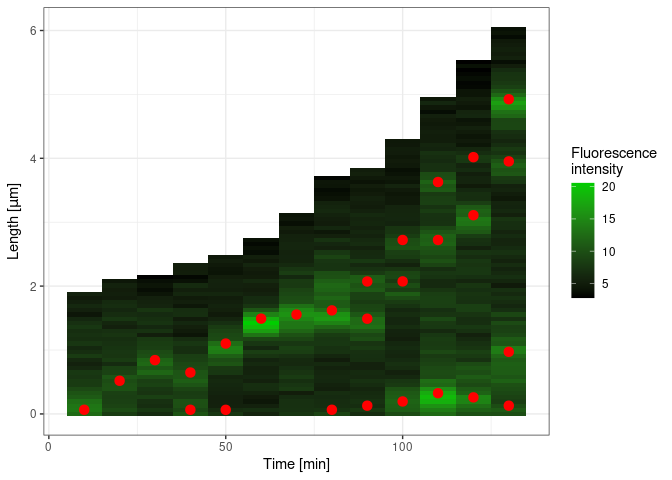

<!-- README.md is generated from README.Rmd. Please edit that file -->

# findpeaks

<!-- badges: start -->

[](https://www.tidyverse.org/lifecycle/#experimental)
<!-- badges: end -->

The goal of findpeaks is finding maxima in fluorescence profile
generated from microscopic time-lapse movie of Streptomyces.

Online version of the app can be found
[here](http://microbesinwroclaw.biotech.uni.wroc.pl:3838/zmm_apps/findpeaks/).

## Installation

You can install the released version of findpeaks from Github, but first
other R packages should be installed:

For running the app package Peaks is required. It can be installed on
linux using:

``` r
devtools::install_version('Peaks', version = '0.2', repos = "http://cran.us.r-project.org")
```

Windows users first have to install
[Rtools 4.0.0](https://cran.r-project.org/bin/windows/Rtools/), which is
necessary for package compilation from source, and then install package
Peaks as above.

Package EBImage can be installed from bioconductor:

``` r

if (!requireNamespace("BiocManager", quietly = TRUE))
    install.packages("BiocManager")
BiocManager::install(version = "3.11")
BiocManager::install("EBImage")
```

Then you should be able to install and run package findpeaks:

``` r
devtools::install_github('astrzalka/findpeaks')

findpeaks::run_app()
```

Peak detection uses R package Peaks. Please cite:

    #> 
    #> To cite package 'Peaks' in publications use:
    #> 
    #>   Miroslav Morhac (2012). Peaks: Peaks. R package version 0.2.
    #>   https://CRAN.R-project.org/package=Peaks
    #> 
    #> ATTENTION: This citation information has been auto-generated from the
    #> package DESCRIPTION file and may need manual editing, see
    #> 'help("citation")'.

Fluorescence profiles data can be prepared using an ImageJ script:
imagej\_get\_profile.ijm , which will save the profiles for all selected
ROIs for each channel separately. It will also save ROIs and duplicated
tiff file of analyzed hypha in the same directory.

All analysis and plotting functions can be also used outside of shiny
application as shown in the example below:

``` r

data <- findpeaks::dane_2
#> Warning: replacing previous import 'colourpicker::runExample' by
#> 'shiny::runExample' when loading 'findpeaks'

result <- findpeaks::find_peaks(data, s = 2.5, m = FALSE, procent = 0.4, threshold = 41)

findpeaks::plot_find_peaks(dane_raw = result[[2]], result[[1]])
```


``` r

#sometimes unwamted complexes can be removed manually

result[[1]] <- result[[1]][-c(4),]
```

Result of the find\_peaks function is a list, where the first data frame
is the localization and fluorescence intensity of each found maximum and
second data frame contains a smoothed fluorescence profile for each time
point.

``` r
head(result[[1]])
#>   dist_base dist_tip int_raw length index time id
#> 1     0.065    1.814  13.573  1.879     1    0  1
#> 2     0.519    1.555   9.695  2.074     2   10  2
#> 3     0.842    1.296  11.766  2.138     3   20  3
#> 5     0.648    1.685  10.423  2.333     4   30  5
#> 6     0.065    2.268   9.251  2.333     4   30  6
#> 7     1.101    1.361  12.642  2.462     5   40  7

head(result[[2]])
#>           y time     x       int
#> 1 0.1186251    0 0.000 0.8911576
#> 2 0.1867306    0 0.065 0.5781144
#> 3 0.2698641    0 0.130 0.8374732
#> 4 0.3667466    0 0.194 1.1553968
#> 5 0.4770584    0 0.259 0.8758192
#> 6 0.5971223    0 0.324 0.4941017
```

Alternatively complexes localizations can be visualized as a kymograph
or a hypha scheme

``` r

findpeaks::plot_kymograph_find_peaks(dane_raw = data, dane_find = result[[1]], color_point = 'red', color_gradient = 'green3', lapse = 10, odwroc = FALSE)
```



``` r

findpeaks::plot_scheme_find_peaks(dane_find = result[[1]], odwroc = FALSE)
```


FLuorescence profiles can also be plotted as ridges plot:

``` r
findpeaks::plot_peaks_ridges(data = data)
```


